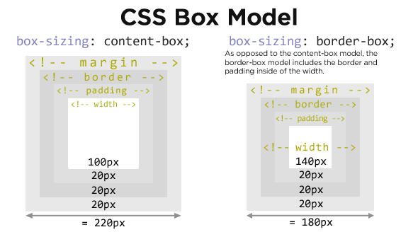
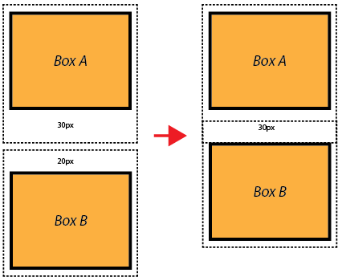

# I NEED TO KNOW
1. In Class we can add multiple Classes for One Element.
class img.png
2. But in ID we cannot add give multiple IDs for One Element.

# Box Sizing = Border Box

The box-sizing property allows us to include the padding and border in an element's total width and height. If you set box-sizing: border-box; on an element, padding and border are included in the width and height: Both divs are the same size now! Hooray!

# Margin Collapse

The top and bottom margins of blocks are sometimes combined (collapsed) into a single margin whose size is the largest of the individual margins (or just one of them, if they are equal), a behavior known as margin collapsing. Note that the margins of floating and absolutely positioned elements never collapse.